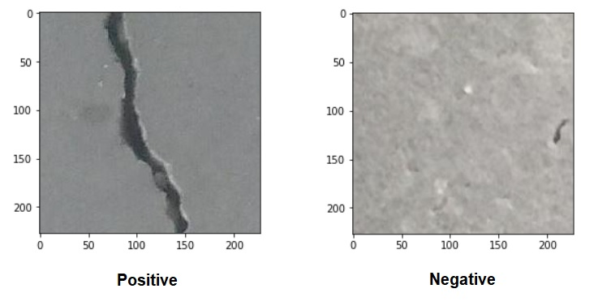

# Concrete Crack Classification

Crack detection is important for structural health monitoring and inspection of buildings. In this project, two models were trained with images of concrete with the aim of distinguishing whether a new image has a crack or not.

The first model was a simple neural netowork with one hidden and output layer and the second model was built using Resnet18, reaching an accuracy of 99% in the test dataset.

### Technologies used:
* Python, numpy
* Pytorch
* Convolutional Neural Networks (CNN)
* Tranfer learning: Resnet18
* jupyter notebook, anaconda

### Dataset

The dataset consists of 40, 000  RGB images, 20,000 with cracks or positive and 20,000 with no cracks or negative. The data can be dowloaded from [Mendeley Data](https://data.mendeley.com/datasets/5y9wdsg2zt/1).

 

